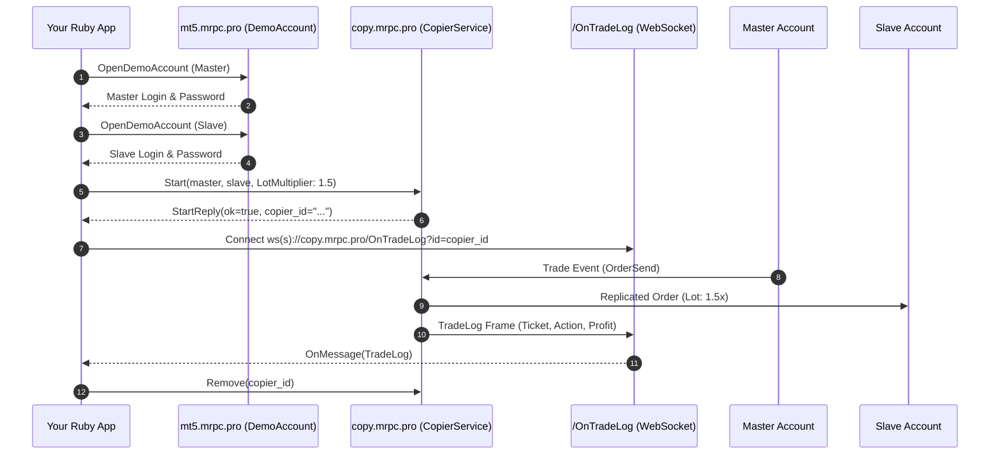

# Quick Start: Your First Project in 10 Minutes

This step-by-step tutorial walks you through building a complete trade replication application in **Ruby** from scratch using **RubyCopier**.

---

## 1. Overview of Steps

In this guide you will:
1. **Provision two demo MetaTrader accounts** via gRPC (`DemoAccount.OpenDemoAccount`).
2. **Connect to MetaRPC Trade Copier** over HTTP/2 gRPC (`copy.mrpc.pro:443`).
3. **Start an active copier** configured with risk multipliers and SL/TP synchronization.
4. **List all registered copiers** and inspect their state.
5. **Stream real-time trade logs** via WebSocket (`/OnTradeLog?id={copierId}`).
6. **Pause and remove** the copier cleanly.

---

## 2. Complete Runnable Code

```ruby
require 'rubycopier'

# 1. Initialize Copier Client
client = RubyCopier::CopierService.new('copy.mrpc.pro:443', user_key: 'YOUR_USER_KEY')

# 2. Start Copier
reply = client.start(
  master: { type: 'MT5', user: 10001, password: 'password1', server: 'MetaQuotes-Demo' },
  slave:  { type: 'MT5', user: 10002, password: 'password2', server: 'MetaQuotes-Demo' },
  risk_type: 'LotMultiplier',
  risk_value: '1.5',
  copy_sl: true,
  copy_tp: true
)

puts "Copier started: #{reply.copier_id}"

# 3. List copiers
copiers = client.list
copiers.each do |c|
  puts "Copier #{c.id}: #{c.master_user} -> #{c.slave_user} (Paused: #{c.paused})"
end

# 4. Cleanup
client.pause(reply.copier_id, paused: true)
client.remove(reply.copier_id)
puts "Copier successfully removed." 
```

---

## 3. How It Works Under the Hood


